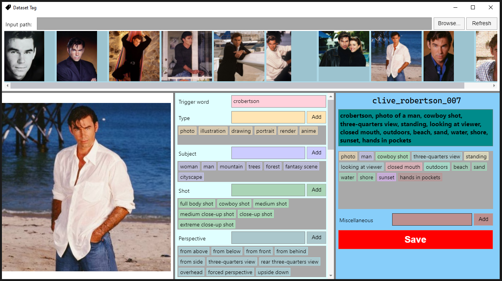

# Dataset Tag
Dataset Tag is a free and open-source tool designed to make the process of image captioning for machine learning datasets a breeze. No longer will you ever dread the thought of captioning a dataset for training a LoRA or a DreamBooth model! The software makes the process of tagging the various elements in an image semi-automatic, ensuring accurate and consistent captions, crucial for the quality of the trained artificial neural network.



## Features

- **Predefined Categories**: Includes various categories such as: 
  - **Type**: `photo`, `illustration`, `drawing`, `portrait`, `render`, `anime`, etc 
  - **Subject**: `man`, `woman`, `mountain`, `trees`, `forest`, `fantasy scene`, `cityscape`, etc.
  - **Shot**: `full body shot`, `cowboy shot`, `medium shot`, `medium close-up shot`, `close-up shot`, `extreme close-up shot`, etc
  - **Perspective**: `from above`, `from below`, `from front`, `from behind`, `from side`, `three-quarters view`, `rear three-quarters view`, `overhead`, `forced perspective`, `upside down`, etc
  - **Pose**: `laying`, `sitting`, `standing`, `leaning`, `walking`, `running`, `jumping`, `posing`, etc
  - **Location**: `on couch`, `on chair`, `in front of mirror`, `at desk`, `on street`, etc
  - **Action**: `eating`, `reading`, `resting`, `playing`, etc
  - **Gaze**: `looking at viewer`, `looking up`, `looking down`, `looking sideways`, `three-quarter gaze`, `rear three-quarter gaze`, `looking sideways and upwards`, etc
  - **Mouth**: `open mouth`, `closed mouth`, `slightly open mouth`, etc
  - **Mouth Action**: `smirk`, `slight smile`, `smile`, `laughing`, `grinning`, etc
  - **Hair**: `long hair`, `short red hair`, `curly blond hair`, etc
  - **Limbs**: `bent knee`, `crossed legs`, `arms raised above head`, `arms extended sideways`, `left palm on forehead`, `right arm on belly`, `holding books`, etc
  - **Subject Description**: `white hat`, `blue shirt`, `silver necklace`, `sunglasses`, `pink shoes`, `silver bracelet`, `green jacket`, etc
  - **Scenery**: `indoors`, `outdoors`, etc
  - **Scene Description**: `flowers wallpaper`, `chair`, `table`, `lamp`, `beach`, `sand`, `water`, `shore`, etc
  - **Lighting**: `sunset`, `strong shadows`, `warm orange light`, `night`, etc
  - **Miscellaneous**: any tag that does not fit in any of the above categories 
- Any category can have its tags removed, updated, and new tags can be added.
- **Thumbnail Previews**: Browse through your dataset images with thumbnail previews, for easy access.
- **Interactive Tagging**: Click on an image and select from pre-existing tags across categories, in order to automatically form a standardized caption.
- **Consistent Formatting**: Captions are always arranged in the same category order, for consistency.
- **Memory Feature**: Remembers both the tags in each category and the tags used for each image, allowing for easy edits later.
- **Replicability**: It ofers the option of copying the trigger words and/or the selected tags using the system's cache memory, and pasting them on other selected images (easy copy/paste of tags among images).
- **Draggable Panel Columns**: Each column has a grid splitter, which can be used to resize them in any ratio you desire.

## Compiling from Source

This is an optional step, there are [releases](https://github.com/BinaryAlley/DatasetTag/releases) that can be used as-is. But for those interested in compiling Dataset Tag from the source code, here's a step-by-step guide to get you started. This process requires a basic understanding of software development tools and the command line.

### Prerequisites

Before you begin, ensure that you have the following installed on your system:

1. .NET 7.0 SDK: Dataset Tag is built using .NET 7.0. Download and install the .NET 7.0 SDK from [Microsoft's official .NET download page](https://dotnet.microsoft.com/en-us/download/dotnet/7.0).
2. Git: To clone the repository, you'll need Git installed. You can download it from [git-scm.com](https://git-scm.com/).

### Cloning the Repository

1. Open a terminal or command prompt.
2. Clone the Dataset Tag repository using Git:
```bash
git clone https://github.com/BinaryAlley/DatasetTag
```    

### Building the Application

1. Navigate to the cloned repository's directory:
```bash
cd DatasetTag/src
```
2. Build the application using the .NET CLI:
```bash
dotnet build
```

### Running the Application from Source

After successfully building the application, you can run it directly from the source:
```bash
dotnet run --project DatasetTag/DatasetTag.csproj
```

### Packaging for Distribution

To create a distributable package of the application, run the following command:
```bash
cd DatasetTag
dotnet publish -c Release -r [Runtime Identifier]
```
Replace `[Runtime Identifier]` with your target platform's runtime identifier, such as `win-x64`, `linux-x64`, or `osx-x64`.

The executable file should be located in the `bin\Release\net7.0\[Runtime Identifier]` directory, starting from the root directory where the repository was cloned.

## Running the Application

Dataset Tag was built using [Avalonia UI](https://avaloniaui.net/), so it is cross-platform and can be run on Linux, Windows, macOS. The process varies slightly depending on the operating system.

### Linux, macOS

1. Make sure you have the [.NET 7.0](https://dotnet.microsoft.com/en-us/download/dotnet/7.0) runtime installed. The process can differ based on your particular distro.
2. Open a terminal and navigate to the directory where the application is located.
3. Run the application using this command:
   ```bash
   dotnet DatasetTag.dll
   ```
4. Depending on your Linux distribution, you might need to install additional dependencies. For instance, if you encounter issues related to `libSkiaSharp`, you might need to install specific libraries like `libice6`, `libsm6`, and `libfontconfig1`. These dependencies are required for `SkiaSharp`, which is used by Avalonia for rendering:
   ```bash
    sudo apt install libice6
    sudo apt install libsm6
    sudo apt install libfontconfig1
   ```

### Windows

1. Navigate to the directory where the application is located.
2. Double click the `DatasetTag.exe` file to run the application.

## Usage

1. Launch the application.
2. For the **Input Path** field, browse and select the directory containing your images dataset, or manually paste the path in the text box.
3. Press the **Refresh** button. At this moment, the previews of the images in the specified input directory will be displayed.
4. Click on any thumbnail, to select that particular image. A larger preview should be displayed on the left column of the window.
5. Write a trigger word, *if you are training a character*. This is very important, as it will be the word associated with the character you are trying to train (it will become the word you use to "activate" the character in your prompts). This is NOT necessary when training a style, as styles are supposed to be applied every time you use the model or LoRA, without a trigger word.
6. Start clicking on any tags in any category that describe the details of the selected image. Order does not matter, as the software will always arrange them in the same categories order.
Some categories only allow you to select a single tag (example: **Shot** - you cannot have an image where the subject is in both close-up and full-body shot).
7. If some category does not contain a tag that you want, you can type that tag in the corresponding text field, and then click **Add**, or press Enter.
8. If there are elements that you feel do not belong to any category, you can add them using the **Miscellaneous** category. 
9. If there are tags that you want to remove from the selected caption tags, or even tags that you want to remove from the predefined categories, you can check the **Remove tags** checkbox, or press the Control key (does not work on Linux) - while holding it or while the checkbox is checked, each
tag will display a close icon, which you can click to remove that tag. Beware, this action cannot be undone.
10. If you want to edit a particular tag, double click it, instead of single click. This will make that tag enter edit mode, where you can change its text. When the focus is moved outside 
its input field, it will exit edit mode, and the changes will be saved.
11. While adding tags, the software will automatically create the caption text from the trigger word (if any) and the selected tags.
12. When you are satisfied, click on the **Save** button. This will create a text file with the same name as the selected image, containing the caption. The file will be saved in the same directory where the image is, and **it will override an existing caption file**!
13. The software also creates a file named `captions.json` in the images dataset directory. This file is the one that enables the program to "remember" what each image had as assigned tags and categories. You can remove it if you wish, but the program will treat that image as uncaptioned, the next time you select it.

## Contributing

This software welcomes community contributions. All forms of input, be it code, bug reports, or feature suggestions, are appreciated.

## Acknowledgments and Credits

#### Captioning tag categories idea

The idea for this software started to take shape after reading this [Reddit post](https://www.reddit.com/r/StableDiffusion/comments/118spz6/captioning_datasets_for_training_purposes/) on captioning datasets. Unfortunately, the user that wrote it deleted their account, so I can only credit them by referencing the original post. 

#### Icon

The application's icon was taken from [OnlineWebFonts](https://www.onlinewebfonts.com/icon/573911). The Close icon was taken from [OnlineWebFonts](https://www.onlinewebfonts.com/icon/560711). Both are licensed under [CC BY 4.0](https://creativecommons.org/licenses/by/4.0/).

#### Application type

The application was built using [Avalonia UI](https://avaloniaui.net/), for easy cross-platform deployment.

#### Images thumbnails

The library used for displaying the thumbnails is [SixLabors ImageSharp](https://github.com/SixLabors/ImageSharp).

**I greatly appreciate the creators and contributors for providing these assets, packages and technologies.**

## License

This project is licensed under the GPLv3.0. See the [LICENSE](./documents/LICENSE.md) file for details.
